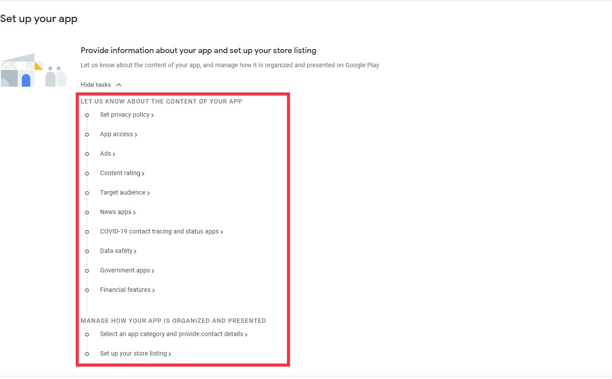
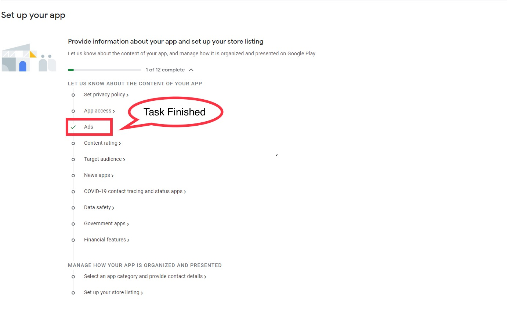
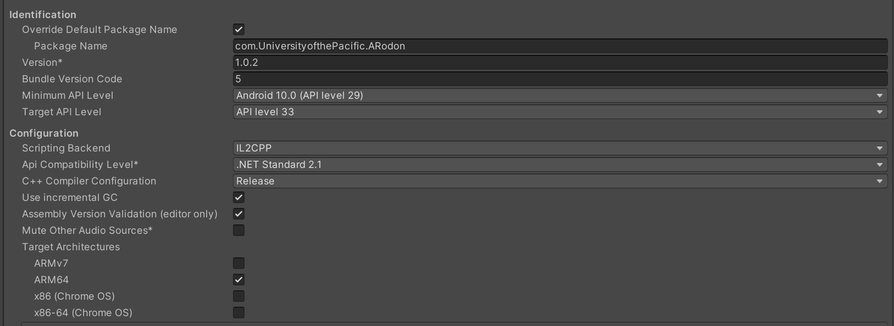
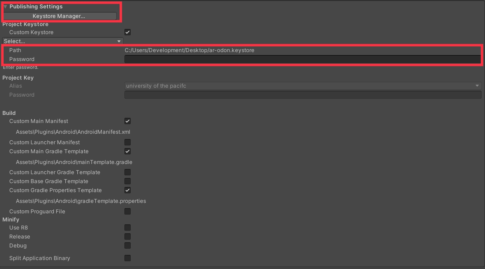
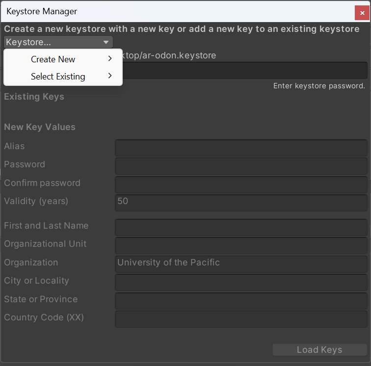
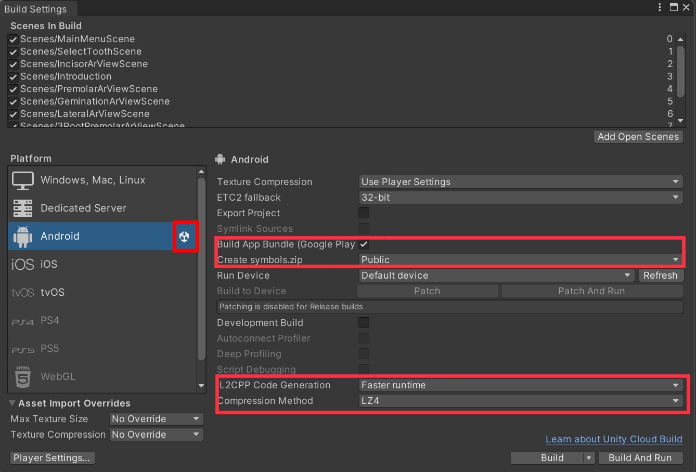
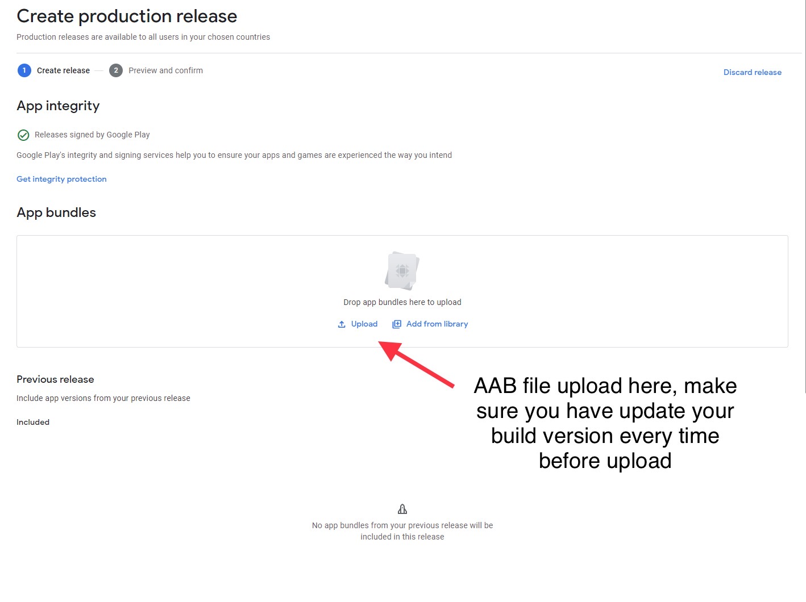
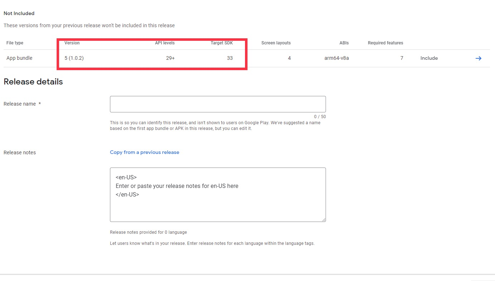

# Uploading Your Unity Project to the Google Play Store
## Date Created: Dec. 2023

## Prerequisites

1. Unity Editor with your project ready.
2. Access to the Cube Software Team's Google Play Developer account.

## Step 1: Configuring Your App in Google Play Console

### Accessing Google Play Console

- Visit [Google Play Console](https://play.google.com/console) and log in.
- Click the blue 'Create app' button (usually under Pinned apps section, on the right side of the page).

### Filling Out App Details

- Enter your app's name and default language.
- Choose the category: App or Game (this can be changed later).
- Select whether it's free or paid.
- Review and complete the Declarations.
- Click the 'Create app' button at the bottom right.

### Completing Initial Setup

- On the Dashboard, under 'Set up your app', click 'View tasks'.
- Complete the following sections:

#### Privacy Policy

- A Privacy Policy is mandatory. Refer to [this video](https://www.youtube.com/watch?v=BfIWE172jj0&ab_channel=CocoCode) for guidance.
- Understand the data your app may collect.
- Enter your Privacy Policy URL and click 'Save'.

#### App Access

- Select the appropriate access level for your app.

#### Ads

- Indicate whether your app contains ads.

#### Content Rating

- Complete the questionnaire to determine your app’s age rating.

#### COVID-19 Tracing and Status Apps

- Specify if your app is related to COVID-19 tracing.

#### Data Safety

- Review Unity's documentation on [Data Safety](https://docs.unity.com/ads/en-us/manual/GoogleDataSafety).
- Complete the section based on the data your app collects.

#### Government Apps

- Indicate if your app is a government app.

#### App Category and Contact Details

- Choose a category and provide contact details.

#### Store Listing

- Fill in all details. The short description appears in the Google Play Store.
- Upload screenshots and an app icon, resized as necessary (e.g., using [PicResize](https://picresize.com/)).

- Base of the Image showing, You should finish all the 12 tasks before jump to the step 2.

## Step 2: Configuring Your Unity Project

### Unity Editor Preparation

- Ensure your Unity Editor includes the Android Build Support module.

### Configure Build Settings

- Navigate to `File > Build Settings` and select 'Android' as the platform. Click 'Switch Platform'.
- Under `Player Settings`:
  - Enter your company and product name, and set the default icon.
  - In `Other Settings`:
    - Set the Package Name in reverse domain format (e.g., `com.yourcompany.yourapp`).
    - Set the version and bundle version code (increment for updates).
    - Choose a minimum API Level (recommended level 32).
    - Select IL2CPP for the Scripting Backend.
    - Under 'Target Architectures', check 'ARM64'.
      
      

### Keystore Configuration

- In `Player Settings`, navigate to `Publishing Settings`.
  
- Use an existing keystore or create a new one via 'Keystore Manager'.
  

### Building the App

- Return to `File > Build Settings`.
- Choose 'Build' for APK or 'Build App Bundle (Google Play)' for AAB.
-  Navigate to 'Create symbols.zip', set to public, click 'Build'.
   
- Save build bundle file in a new build folder.(creating a new build folder within your project is recommended)

## Step 3: Uploading Your App to Google Play Console

- Navigate to Production tab.
- Select 'Countries/regions'.
- Click 'Release', create a new release, upload AAB file.
  
- Check release name and notes.
  
- It is hightly recommended to double check Version, API levels, and Target SDK before you publish.
## Step 4: Waiting for Review

- Find your version in Production tab, Release section.
- Check the status: Status changes from 'In review' to 'Published' means you app has been successfully published on Google Play Store.
- If you receive 'App rejected', click [App Rejection and Troubleshooting](https://github.com/HowardLee134/Documentation-/blob/main/App%20Rejection%20and%20Troubleshooting%20.md). 
- Test the app via Google Play Store after release.

## Conclusion

Follow these steps for a successful upload of your Unity project to the Google Play Store. Regularly test your app post-publication for optimal performance.

This guide and the Unity project are the results of collaborative efforts by the following:

- **Ming Hao (Howard) Lee** - *Software Developer*
- **University of the Pacific Cube Software Team**

---

For any inquiries, contributions, or further information, please contact the University of the Pacific Cube Software Team.
